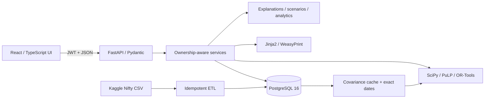
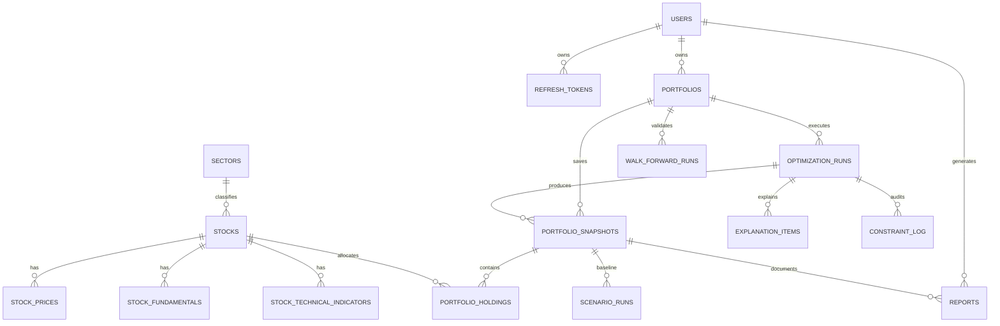

# System Design

*Project: AI-Driven Personalized Investment Planning and Portfolio Optimization (OptiVest)*

## Implemented architecture

The repository-root `src/` Vite app uses React Query for server state and a single typed client. FastAPI routes delegate to services; SQLAlchemy uses async sessions, while solver/PDF work leaves the event loop. Optimization returns framework-independent typed results used by explainability, scenarios, analytics and reports.

## Entity relationships

All application keys are UUIDs. Money is PostgreSQL `Numeric` in INR. Market tables have natural-key uniqueness and descending date indexes.

| Table | Implemented purpose and key rule |
|---|---|
| `users` | Unique email, Argon2 hash, profile. |
| `refresh_tokens` | Unique token hash, expiry, revocation and rotation chain (`0002`). |
| `sectors`, `stocks` | Unique sector names/symbols. |
| `stock_prices` | OHLCV, adjusted close, daily return; unique stock/date. |
| `stock_fundamentals` | Dated PE, PB, cap, yield, EPS, beta; unique stock/date. |
| `stock_technical_indicators` | Dated SMA, RSI, MACD, volatility; unique stock/date. |
| `portfolios` | User-owned decision workspace. |
| `optimization_runs` | Solver, INR budget, objectives, config JSONB, status, timing. |
| `portfolio_snapshots` | Persisted return, volatility, Sharpe and diversification. |
| `portfolio_holdings` | Weight, INR allocation and shares by snapshot/stock. |
| `explanation_items` | Decision, taxonomy, contributions, constraint and narrative. |
| `constraint_log` | Binding flag, slack and shadow price. |
| `scenario_runs` | Baseline/result references, type and shock JSONB. |
| `reports` | User, snapshot, type, path and generation time. |
| `covariance_cache` | Unique universe/lookback/as-of matrices and aligned dates. |
| `walk_forward_runs` | Frequency, lookback, constraint snapshot and complete rolling result JSONB (`0003`). |

The live database has 17 application tables plus `alembic_version`.

## Complete API route table

Every route starts `/api/v1`; all except signup/login/refresh require authentication.

| Method | Route | Purpose |
|---|---|---|
| POST | `/auth/signup` | Register and issue token pair. |
| POST | `/auth/login` | Authenticate and issue token pair. |
| POST | `/auth/refresh` | Rotate refresh token. |
| POST | `/auth/logout` | Revoke refresh token. |
| GET | `/me` | Read authenticated profile. |
| PATCH | `/me` | Update authenticated profile. |
| GET | `/stocks` | List stocks; optional sector filter. |
| GET | `/sectors` | List sectors. |
| GET | `/portfolios` | List owned portfolios. |
| POST | `/portfolios` | Create an owned portfolio. |
| GET | `/portfolios/{portfolio_id}` | Read an owned portfolio and latest snapshot. |
| PATCH | `/portfolios/{portfolio_id}` | Update an owned portfolio. |
| GET | `/portfolios/{portfolio_id}/snapshots` | List snapshots. |
| POST | `/portfolios/{portfolio_id}/optimize` | Build, solve, explain and persist. |
| GET | `/optimization-runs/{run_id}` | Poll run status. |
| POST | `/portfolios/{portfolio_id}/scenarios` | Transform inputs and re-solve. |
| GET | `/portfolios/{portfolio_id}/snapshots/{snapshot_id}/analytics` | Return methodology audit and analytics. |
| POST | `/portfolios/{portfolio_id}/walk-forward` | Run and persist rolling re-estimation. |
| GET | `/portfolios/{portfolio_id}/walk-forward/{run_id}` | Fetch an owned persisted walk-forward run. |
| POST | `/portfolios/{portfolio_id}/snapshots/{snapshot_id}/reports` | Generate PDF. |
| GET | `/reports` | List report history. |
| GET | `/reports/{report_id}/download` | Return authenticated PDF bytes. |

JSON endpoints use a consistent data/error envelope. PDF downloads are binary. Ownership violations return 403; access-token expiry triggers one refresh rotation in the client.
