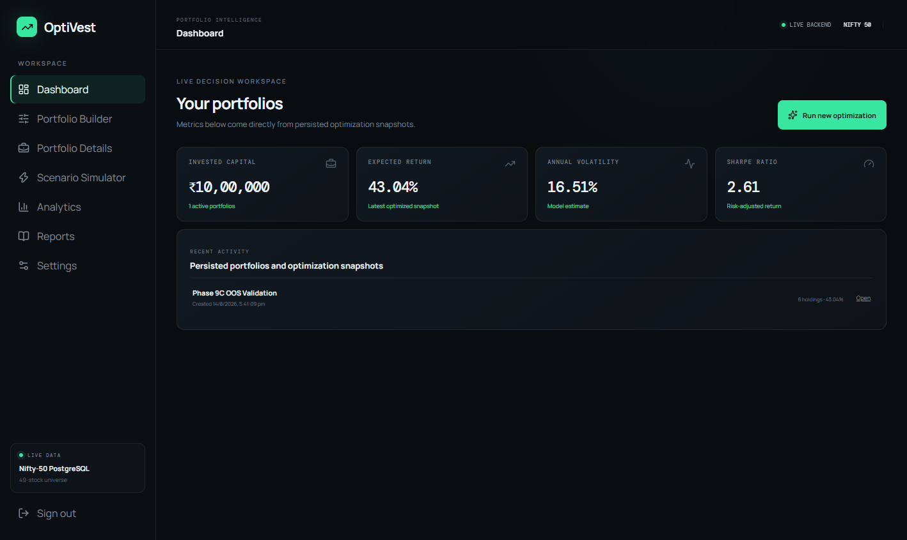
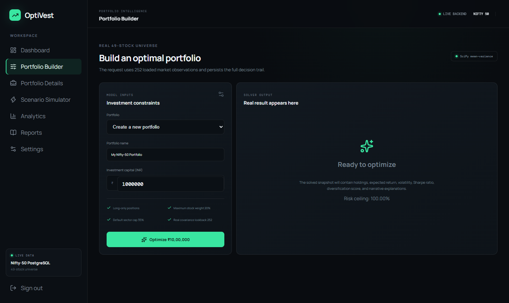
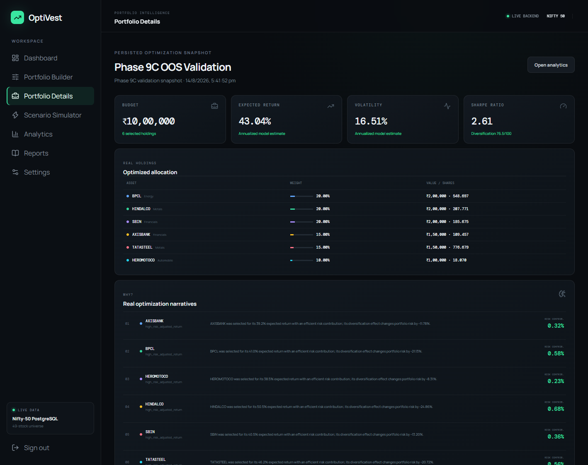
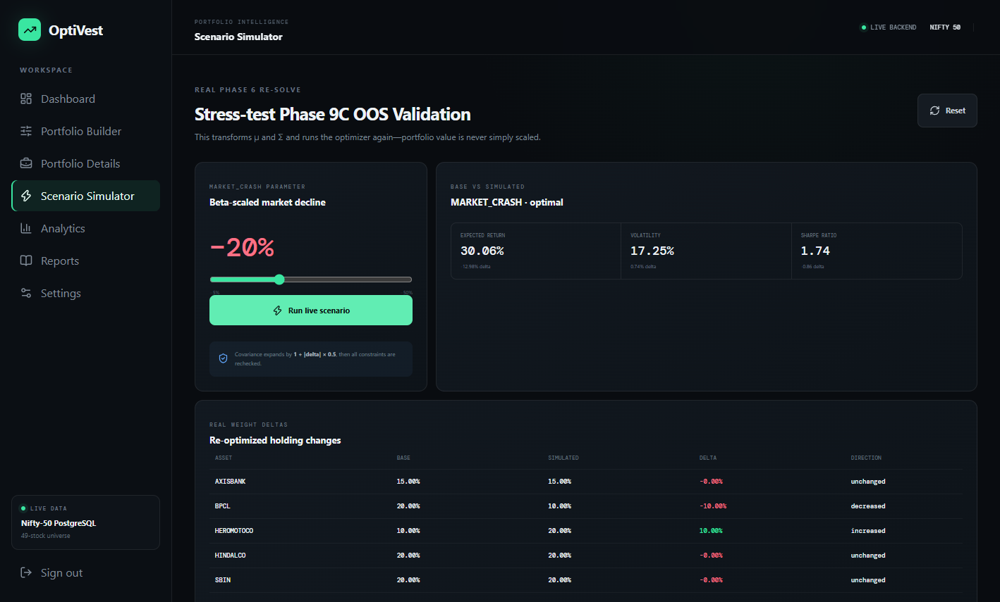
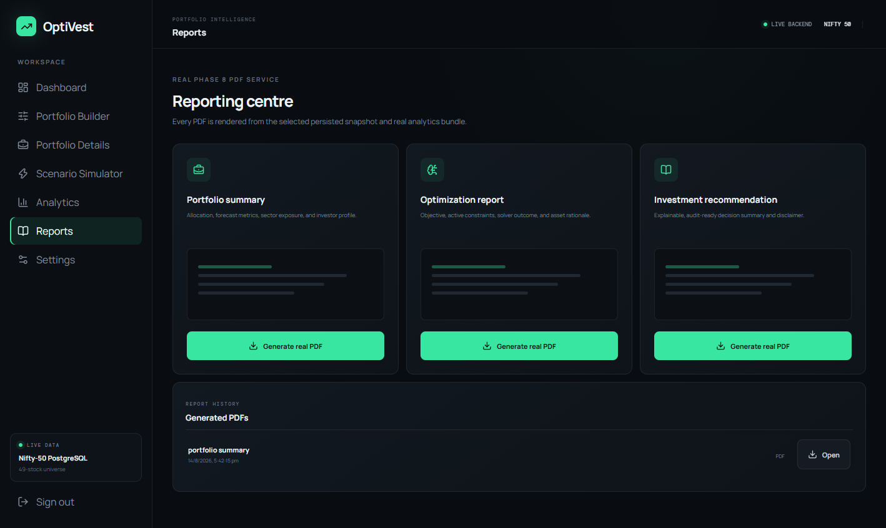
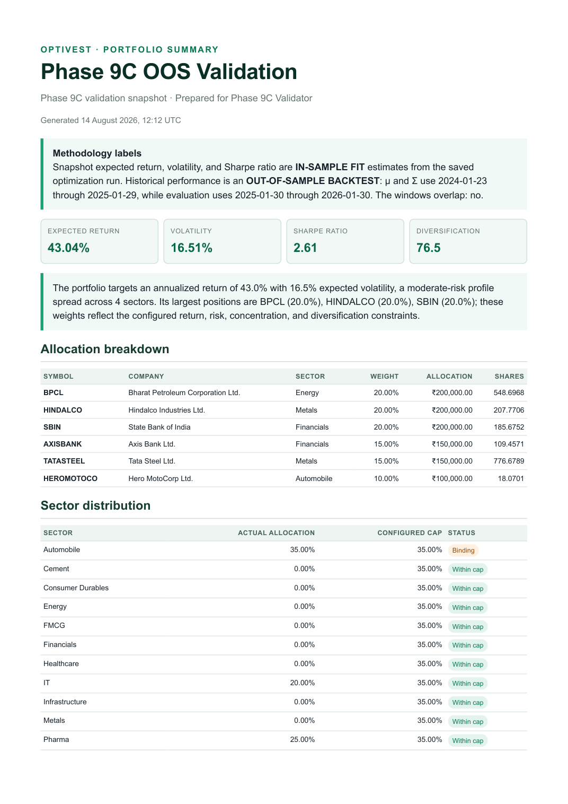

# UI and UX Evidence

*Project: AI-Driven Personalized Investment Planning and Portfolio Optimization (OptiVest)*

Screenshots were captured on 15 August 2026 from the live React app at `127.0.0.1:5173`, connected to FastAPI and the loaded PostgreSQL database. They are not wireframes or fixture renders.

## Dashboard

**Figure 3.1.** `GET /portfolios` supplies the persisted ₹10,00,000 portfolio, 43.04% saved fit estimate, 16.51% model volatility, 2.61 fitted Sharpe and six holdings.

## Portfolio Builder

**Figure 3.2.** The builder submits budget and model rules to the optimization endpoint, handles pending/solved/infeasible/failed states, and navigates with the returned snapshot UUID.

## Portfolio Details and “Why?”

**Figure 3.3.** Real BPCL/HINDALCO/SBIN/AXISBANK/TATASTEEL/HEROMOTOCO holdings followed by visible narratives and marginal risk contributions loaded from `explanation_items`.

## Scenario Simulator

**Figure 3.4.** A 20% beta-scaled market crash is re-solved: expected return 30.06%, volatility 17.25%, Sharpe 1.74; BPCL falls 10 percentage points and HEROMOTOCO rises 10.

## Analytics

**Figure 3.5.** The methodology banner reports 252 fit observations, 249 evaluation observations and zero overlap. It separates 10.31% realized return, 15.22% volatility, -13.26% drawdown and 0.68 realized Sharpe from fit estimates.

## Reports and PDF

**Figure 3.6.** Three real report templates and authenticated history/download.

**Figure 3.7.** First page of the actual two-page, 20,388-byte PDF. Its methodology box labels saved metrics as in-sample fit and history as an out-of-sample backtest with no overlap.

## UX principles and live finding

- Shared navigation and backend/universe status remain visible.
- React Query provides shared loading, error/retry and invalidation behavior.
- Indian numbering and rupee formatting are used throughout.
- Fit, realized, baseline and simulated metrics are never silently conflated.
- Protected routes redirect unauthenticated users; ownership and network errors use the shared error component.

Live capture found a defect missed by mocked tests: native `fetch` was stored as an object method, so Chrome rejected the receiver as an illegal invocation. The client now binds fetch to `globalThis`, with a regression test. This demonstrates why browser verification complements component tests.
